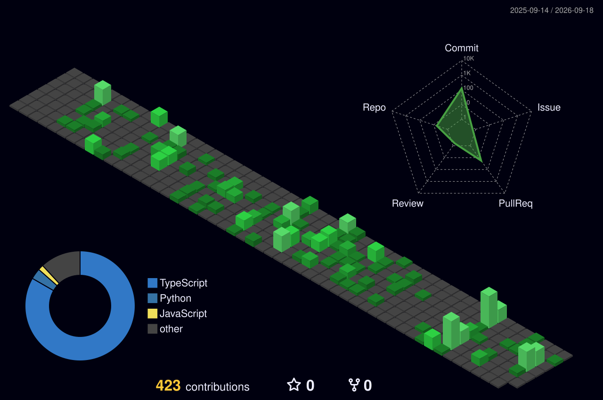

# Hi, I'm Afnan 👋🏼

I'm a Software Engineer who enjoys turning ideas into products, whether that's crafting smooth UIs, building reliable APIs, or figuring out why something broke at 2 AM.

Lately, I've been building with **React**, **Next.js**, **TypeScript**, and **Python**, while diving deeper into system design, cloud, and AI.

  

## 🛠️ Tools & Technologies

  <!-- Frontend -->
  
  
  
  

  <!-- Backend -->
  
  
  
  
  
  
  

  <!-- Data -->
  
  
  

  <!-- Observability -->
  
  
  

  <!-- Cloud & DevOps -->
  
  
  
  

  <!-- CMS & Design -->
  
  

## 🌱 Currently Exploring

* AI & LLM applications
* Scalable system design
* Building things people actually enjoy using

## ⚽ Outside of Work

* Football fanatic
* Toastmasters member
* Side project enthusiast
* Always learning something new

## 🤝🏼 Find Me Here

* 💼 <https://linkedin.com/in/afnansohail99>
* 🌐 <https://afnansohail.github.io>

> *Building cool things, breaking a few along the way, and learning from all of it.*

  

